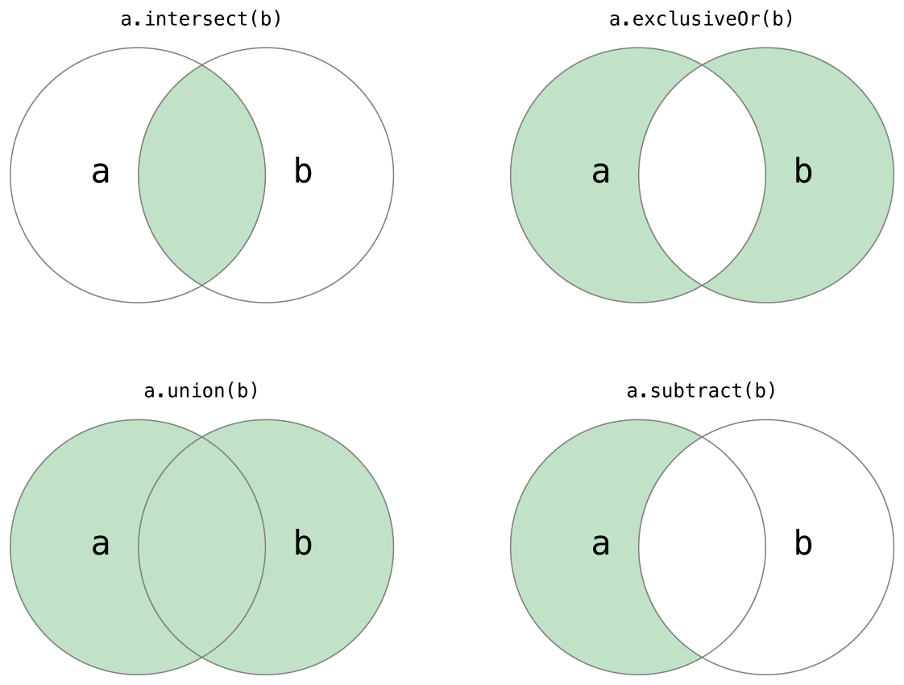

# Swift中文教程（四） 集合类型

Swift 提供三种集合类型来存储集合，数组，sets（集合）和字典。数组是一个同类型的序列化列表集合。sets是特定类型的无序集合。字典是一个能够使用类似于键的唯一标识符来获取值的非序列化集合。

在Swift中，数组，sets（集合）和字典里的键和值都必须是明确的某个特定类型。这意味这数组和字典不会插入一个错误的类型的值,以致于出错。这也意味着当你在数组和字典中取回数值的时候能够确定它的类型。

Swift 使用确定的集合类型可以保证代码工作是不会出错，和让你在开发阶段就能更早的捕获错误。
> swift中数组，set和字典被是实现成常用的集合，更多请关注[Generics](https://developer.apple.com/library/ios/documentation/Swift/Conceptual/Swift_Programming_Language/Generics.html#//apple_ref/doc/uid/TP40014097-CH26-ID179)

##可变集合
如果你创建了一个数组,set或者字典，并且申明他为变量，那么该集合就是可变的。这就意味着你可以通过添加、删除或者改变他的item来改变这个集合。如果你申明了数组，set或者字典为常量，那么他就没办法修改。他的内容和大小都没法修改。

>如果集合不需要修改，尽量申明成常量。这样编译器会优化你的集合。

## 数组

数组是储存同类型多数值的序列化列表。同样的值可以在数组的不同位置出现多次。

>swift中的Array 是桥接自Foundation的NSArray。更多请关注[Using Swift with Cocoa and Objective-C (Swift 2.2).
](https://developer.apple.com/library/ios/documentation/Swift/Conceptual/BuildingCocoaApps/index.html#//apple_ref/doc/uid/TP40014216)

###数组的简略语法

定义数组的完整写法是Array<SomeType>，其中SomeType是你想要包含的类型。你也可以使用类似于SomeType[]这样的简略语法。虽然这两种方法在功能上是相同的。但是我们更推荐后者，而且它会一直贯穿于本书。

#### 创建一个空的数组
可以使用构造语句来创建某些类型的数组
	
	var someInts = [Int]()
	print("someInts is of type [Int] with \(someInts.count) items.")
	// prints "someInts is of type [Int] with 0 items"
	
注意someInts在初始化时就被定义成int的数组，是无法添加其他类型的。

如果数组已经被制定了值类型，你就可以通过‘[]’空的中括号创建一个空的数组。
	
	someInts.append(3)
	// someInts now contains 1 value of type Int
	someInts = []
	// someInts is now an empty array,but is still of type [Int]

####创建一个默认数值的数组
swift中数组也可以创建并且出实话一个带有默认个数和相同的默认值的数组。你传递给初始化函数数组个数（count）和一个合适类型的默认值(repeatedValue)
	
	var threeDoubles = [Double](count:3,repeatedValue:0.0)
	// threeDoubles is type [Double],and equals [0.0,0.0,0.0]

####创建一个数组由其他两个数组相加
最后，你可以使用（+）操作符就能创建一个新的数组，把两个存在的数组添加进来
这个新的数组类型从你添加的两个数组中推断出来

	var anotherThreeDoubles = [Double](count:3,repeatedValue:2.5)
	// anotherThreeDoubles is of type [Double],and equals [2.5,2.5,2.5]
	var sixDoubles = threeDouble + anotherThreeDoubles
	// sixDoubles is inferred as [Double],and equals [0.0,0.0,0.0,2.5,2.5,2.5]

####使用数组实量创建数组
你可以用一个数组实量（Array Literals）来初始化一个数组，它是用简略写法来创建一个包含一个或多个的值的数组。一个数组实量（Array Literals）是由它包含的值，“,”分隔符 已经包括以上内容的中括号对“[]”组成：

    [value 1, value 2, value 3]

下面的例子是创建一个叫shoppinglist，储存字符串（String）类型的数组。

    var shoppingList:[String] = ["Eggs", "Milk"]
    // 使用两个初始化参数来初始化shoppingList

shoppinglist变量被定义为字符串（String）类型的数组，写作[String]。因为这个数组被确定为字符串类型（String），所以它只能储存字符串（String）类型的值。在这里，我们用两个字符串类型的值（”Eggs” and “Milk”）和数组实量（Array Literals）的写法来初始化shoppingList数组。

> 注意
shoppingList数组是被定义为一个变量（使用var 标识符）而不是常量（使用let 标识符），所以在下面的例子可以直接添加元素。

在这个例子中，数组实量（Array Literals）只包含两个字符串类型的值，这符合了shoppingList变量的定义（只能包含字符串（String）类型的数组），所以被分配的数组实量（Array Literals）被允许用两个字符串类型的值来初始化。

得益于Swift的类型推断，当你用相同类型的值来初始化时，你可以不写明类型。初始化shoppingList可以用下面这个方法来代替。

    var shoppingList = ["Eggs", “Milk"]

因为数组实量（Array Literals）中所有的值都是同类型的，所以Swift能够推断shoppingList的类型为字符串数组（[String]）。

### 读取和修改数组

你可以通过方法和属性，或者下标来读取和修改数组。

通过只读属性count来读取数组的项数；

    print("The shopping list contains \(shoppingList.count) items.")
    // 打印出 "The shopping list contains 2 items.”

通过一个返回布尔类型的isEmpty属性检查数组的项数是否为0

    if shoppingList.isEmpty {
        print("The shopping list is empty.")
    } else {
        print("The shopping list is not empty.")
    }
    // 打印出 "The shopping list is not empty."

在数组末尾增加一项可以通过append方法

    shoppingList.append("Flour")
    // shoppingList 现在包含3项

同理，也可以用（+=）操作符来把一个元素添加到数组末尾

    shoppingList += "Baking Powder"
    // shoppingList 现在包含4项

你也可以用（+=）操作符来把一个数组添加到另一个数组的末尾

    shoppingList += ["Chocolate Spread", "Cheese", "Butter"]
    // shoppingList 现在包含7个元素

从数组中取出一个值可以使用下标语法。如果你知道一个元素的索引值，你可以数组名后面的中括号中填写索引值来获取这个元素

    var firstItem = shoppingList[0]
    // firstItem 等于 “Eggs"

注意，数组的第一个元素的索引值为0，不为1，Swift的数组的索引总是从0开始；

你可以使用下标语法通过索引修改已经存在的值。

    shoppingList[0] = "Six eggs"
    //列表中的第一个值等于"Six eggs" 而不等于 “Eggs"

你可以使用下标语法一次性改变一系列的值，尽管修改的区域远远大于要修改的值。在下面的例子中， 把 “Chocolate Spread”, “Cheese”和”Butter”替换为”Bananas”和”Apples”:

    shoppingList[4...6] = ["Bananas", "Apples"]
    // shoppingList 现在包含6个元素

> 注意，你不能使用下标语法在数组中添加一个元素，如果你尝试使用下标语法来获取或者设置一个元素，你将得到一个运行时的错误。尽管如此，你可以通过count属性验证索引是否正确再使用它。除非count等于0（也就是说数组是空的），最大的索引都是count-1，因为数组的索引从0开始计算。

在一个特定的索引位置插入一个值，可以使用insert(atIndex:)方法

    shoppingList.insert("Maple Syrup", atIndex: 0)
    // shoppingList 现在包含7个元素
    // "Maple Syrup" 在数组的第一位

这里调用insert方法指明在shoppingList的索引为0的位置中插入一个新元素 “Maple Syrup”

同理，你可以调用removeAtIndex方法移除特定的元素。这个方法移除特定索引位置的元素并返回这个被移除的元素（尽管你可能并不关心这个返回值）。

    let mapleSyrup = shoppingList.removeAtIndex(0)
    // 索引位置为0的元素被移除
    // shoppingList 现在包含6个元素, 不包括 Maple Syrup
    // mapleSyrup 常量等于被移除的 "Maple Syrup" 字符串

当元素被移除的，数组空缺的位置将会被填补，所以现在索引位置为0的元素再一次等于”Six eggs”:

    firstItem = shoppingList[0]
    // firstItem 现在等于 "Six eggs”

如果你想从数组中移除最后一个元素，使用removeLast方法比removeAtIndex更方便，因为后者需要通过count属性计算数组的长度。和removeAtIndex方法一样，removeLast会返回被移除的元素。

    let apples = shoppingList.removeLast()
    //元素的最后一个元素被移除
    // shoppingList 现在包含5个元素，不包括 cheese
    // apples 常量 现在等于被移除的 "Apples" string

### 遍历数组

可以使用for－in循环来遍历数组中的值

    for item in shoppingList {
        print(item)
    }
    // Six eggs
    // Milk
    // Flour
    // Baking Powder
    // Bananas

如果既需要每个元素的值，又需要每个元素的索引值，使用enumerate函数代替会更方便，enumerate函数对于每一个元素都会返回一个包含元素的索引和值的元组（tuple）。你可以在遍历部分分解元素并储存在临时变量或者常量中。

    for (index, value) in enumerate(shoppingList) {
        print("Item \(index + 1): \(value)")
    }
    // Item 1: Six eggs
    // Item 2: Milk
    // Item 3: Flour
    // Item 4: Baking Powder
    // Item 5: Bananas

如需更多for-in 循环信息, 参见 [For Loops](https://developer.apple.com/library/ios/documentation/Swift/Conceptual/Swift_Programming_Language/ControlFlow.html#//apple_ref/doc/uid/TP40014097-CH9-ID121).

##Sets
一个集合存储了一串无序的相同类型的数据。如果对顺序没有要求，或者只是用一次的时候，可以使用set来替代数组。
>swift set类型桥接自Foundation中的NSSet类
>参见[Using Swift with Cocoa and Objective-C] (https://developer.apple.com/library/ios/documentation/Swift/Conceptual/BuildingCocoaApps/index.html#//apple_ref/doc/uid/TP40014216).

###set类型中的哈希值
储存进一个集合的类型必须是可以哈希化的。该类行必须提供一个方法来计算它本身的哈希值。哈希值是一个int值。所有相同的对象的哈希值是一样的。如果a == b 的返回值和 a.hashValue == b.hashValue 的返回值是一样的，
所有的swift基本类型（String,Int,Double,Bool）默认是可以哈希化的。而且可以用类设置值类型或者字典键类型。没有关联值得枚举值也是默认可以哈希化的。
>你可用使用自定义类型来设置值类型或字典类型，自定义类型需要从swift标准库遵守哈希化协议。遵守哈希化协议的类型必须提供一个叫做hashValue的方法（返回类型为Int）。hashValue的值在不同的程序或相同的程序中返回不要求相同。
>因为哈希化协议是可变的。遵守协议的类型必须实现运算符（== or ‘is equal’）。Equatable协议要求必须实现“==”成一个等价关系。见下面的例子
>	a == a （自反性）
>	a == b 相当于	b == a（对称性）
>	a == b && b == c 相当于 a == c (传递性)
>查看相关protocol资料，详见[Protocols](https://developer.apple.com/library/ios/documentation/Swift/Conceptual/Swift_Programming_Language/Protocols.html#//apple_ref/doc/uid/TP40014097-CH25-ID267)

###集合类型语法
集合类型的语法是Set<Element>，Element是允许存入集合中的类型。
更数组不同的是，集合没有简便方法。

####创建和初始化一个空集合
你可以通过某些类型的构造方法来创建一个空的集合
	
	var letters = Set<Character>()
	print("letters is if type Set<Character> with \(letters.count) items")
	//Prints "letters is of type Set<Character> with 0 items."

>letters变量的类型是由Set<Character>的构造器获得。

如果上下文已经提供了类型信息，就可以通过设置一个空的数组实例来创建一个空的集合

	letters.insert("a")
	// letters now contains 1 value of type Character
	letters = []
	// letters is now an empty set, but is still of type Set<Character>

####通过数组实例创建创建集合
你也可以通过一个数组实例创建集合。这是一个简写的方式写入一或多个值。
下面的例子，favoriteGenres 存储多个string 值
	
	var favoriteGenres:Set<String> = ["Rock","Classical","Hip hop"]
	//favoriteGenres has been initialized with three initial items
	
favoriteGenres变量被定义成一个字符串的集合，写成Set<String>.因其指定了值类型是字符创，所以他只能储存字符串的值，这里favoriteGenres被初始化并赋值成（“Rock”，“Classical” ，“Hip hop”）.

集合类型不能从数组常量中推断出来，所以集合类型中Set关键字必须加上。结合swfit的特性，用包含值得数组实例初始化的话，你不需要写集合包含的类型。favoriteGenres可以被简写成这样：
		
	var favoriteGenres:Set = ["Rock","Classical","Hip hop"]
	
因为数组实例中的所有值都是一个类型，swift可以推断出一个正确的类型给favoriteGenres变量，为Set<String>

####访问和修改一个集合
可以通过集合的方法和属性来访问和改变他
获取一个set的item数量，使用它的只读属性count
	
	print("I have \(favoriteGenres.count) favorite music genres.")
	// Prints "I have 3 favorite music genres."
	
使用布尔类型的isEmpty 快捷的检查他的count是不是 0

	if favoriteGenres.isEmpty {
	    print("As far as music goes, I'm not picky.")
	} else {
	    print("I have particular music preferences.")
	}
	// Prints "I have particular music preferences."
用 insert(_:)方法添加一个item
	
	favoriteGenres.insert("Jazz")
	// favoriteGenres nw contains 4 items

通过 remove(_:)方法来删除一个item，如果集合拥有这个item，返回被remove的值，如果没有返回nil，当然可以用 removeAll方法移除所有的items
	
	if	let removedGenre = favoriteGenres.remove("Rock") {
		print("\(removedGenre)? I'm over it.")
	} else {
		print("I never much cared for that.")
	}
	// Prints "Rock? I'm over it."
	
通过contains(_:)方法来检查集合是否包含该item
	
	if favoriteGenres.contains("Funk") {
	    print("I get up on the good foot.")
	} else {
	    print("It's too funky in here.")
	}
	// Prints "It's too funky in here."
	
####遍历集合
你可以使用for-in来遍历集合的所有值

	for genre in favoriteGenres {
	    print("\(genre)")
	}
	// Classical
	// Jazz
	// Hip hop
	
###执行集合操作
您可以有效地执行基本设置操作,如结合两套在一起,确定哪些值两组的共同点,或决定是否两套包含所有,或没有一个相同的值。

####基本的集合操作
下面的说明描述了两个集合（a,b）各种集合操作的结果所代表的阴影区域。

1. intersect(\_:)方法：返回两个集合都拥有的元素的集合，
2. exclusiverOr(\_:)方法:返回两个集合去除都拥有的元素后的所有的元素的集合
3. union(\_:)方法：返回两个集合的所有元素的集合
4. subtract(\_:)方法：返回去除目标集合中另一个集合所包含的元素所得的集合

	let oddDigits: Set = [1, 3, 5, 7, 9]
	let evenDigits: Set = [0, 2, 4, 6, 8]
	let singleDigitPrimeNumbers: Set = [2, 3, 5, 7]
	 
	oddDigits.union(evenDigits).sort()
	// [0, 1, 2, 3, 4, 5, 6, 7, 8, 9]
	oddDigits.intersect(evenDigits).sort()
	// []
	oddDigits.subtract(singleDigitPrimeNumbers).sort()
	// [1, 9]
	oddDigits.exclusiveOr(singleDigitPrimeNumbers).sort()
	// [1, 2, 9]

####集合之间的项目关系和相等
下面的插图描述了三个集合a,b和c和重叠区域代表元素集之间共享。设置a是b的超集,因为包含了所有元素b。相反地,b是a的一个子集,因为所有元素b也包含于a。b,c是不相交的,因为他们没有共同之处。

1. "=="(is equal)方法:判断两个集合是否拥有相同的元素,相同返回true，反之false
2. isSubsetOf(_:)方法：判断目标集合是是否为参数集合的子集，是则返回true，反之false
3. isSupersetOf(_:)方法：判断目标集合是否为参数集合的超集，是则返回true，反之false
4. isStrictSubsetOf(\_:)和isStrictSupersetOf(\_:)方法：判断目标是否是子集和超集，但是必须是两个集合不相等，满足以上条件返回true，反之false
5. isDisjointWith(\_:)方法：判断两个集合有无相同元素，有相同元素则返回false，反之true。

	let houseAnimals: Set = ["🐶", "🐱"]
	let farmAnimals: Set = ["🐮", "🐔", "🐑", "🐶", "🐱"]
	let cityAnimals: Set = ["🐦", "🐭"]
	 
	houseAnimals.isSubsetOf(farmAnimals)
	// true
	farmAnimals.isSupersetOf(houseAnimals)
	// true
	farmAnimals.isDisjointWith(cityAnimals)
	// true

## 字典

字典是储存同一类型多个值的容器。每一个值都对应这一个唯一的键（Key），就像是字典内的每一个值都有一个标识符。和数组内的元素是有区别的，字典内的元素是没有特殊的序列的。当你需要根据标识符来查找批量的值时，就可以使用字典，和在真实世界的字典中寻找某个字的解释相似。

Swift字典储存一个特定类型的键和值，与Objective-C的NSDictionary 和NSMutableDictionary不同，因为它们是使用各种的对象来作为它们的键和值，而且并不提供任何有关对象的具体信息。在Swift中，对于一个特定的字典，它所能储存的键和值的类型都是确定的，无论是明确声明的类型还是隐式推断的类型。

Swift的字典写法是Dictionary<KeyType,ValueType>,KeyType是你想要储存的键的类型，ValueType是你想要储存的值的类型。

唯一的限制就是KeyType必须是可哈希的（hashable）——就是提供一个形式让它们自身是独立识别的。Swift的所有基础类型（例如字符串（String）,整形（Int），双精度（Double）和布尔（Bool））在默认是可哈希的（hashable），和这些类型都常常被当作字典的键。没有协助值（associated values）的枚举成员（具体描述在 Enumerations）默认也是可哈希的（hashable）。

### 创建一个空字典

和字典一样，你可以使用确定类型的语法创建一个空的字典。

    var namesOfIntegers = [Int:String]()
    // namesOfIntegers 是一个空的 [Int: String] 类型的字典

这个例子创建一个Int，String类型的字典来储存可读性较好的整数值。它的键是Int类型，它的值是String类型。

如果 上下文（context ）中已经提供类型信息，可用一个字典实量（Dictionary Literal）创建一个空的字典，写作[;]（由一对［］包含一个冒号：）

    namesOfIntegers[16] = "sixteen"
    // namesOfIntegers现在包含1 个键值对
    namesOfIntegers = [:]
    // namesOfIntegers 是一个类型为Int, String的空字典。

### 字典实量（Dictionary Literals）

你可以直接用一个字典实量（Dictionary Literals）初始化一个字典。和前面定义一个数组实量（Array Literals）的语法一样。字典实量（Dictionary Literals）就是使用简略写法直接写一个或者多个对应的键和值对来定义一个字典。

一个键值对是一个键和值的组合。在字典实量（Dictionary Literals）里面，每一个键值对总是用一个冒号把键和值分割。键值对的写法就想是一个列表，使用逗号分割，并被一对中括号［］包含着：

    [key 1: value 1, key 2: value 2, key 3: value 3]

在下面的例子，将会创建一个字典来储存国际机场的名字。在这个字典里面，键是三个字的国际航空运送协会代码，以及它的值是机场的名称：

    var airport :[String: String] = ["TYO": "Tokyo", "DUB": “Dublin"]

airport字典被定义为一个类型为[String:String]，这意味这，这个字典的键类型是字符串String，和它的值的类型也是String。

> 注意
airport字典是被定义为一个变量（使用var 标识符）而不是常量（使用let 标识符），所以在下面的例子可以直接添加元素。

airport字典使用一个包含两个键值对的字典实量（Dictionary Literals）来初始化。第一对有一个叫“TYO”的键和一个叫“Tokyo”的值，第二对有一个叫“DUB”的键和一个叫“Dublin”的值。

这个字典实量（Dictionary Literals）包含两个字符串（String）：字符串对。这符合airport变量定义的类型（一个字典只包括字符串（String）键和字符串（String）值），所以在分配字典实量（Dictionary Literals）的时候被允许作为airport字典的两个初始化元素。

和数组一样，如果你初始化一个字典的时候使用相同的类型，你可以不指明字典的类型。
airport初始化可以用下面这个简略写法来代替：

    var airports = ["TYO": "Tokyo", "DUB": “Dublin”]

因为所有的键在字面上都是相同的类型，同样，所有的值也是同样的类型，所以Swift可以推断为[String:String]是airports字典的正确类型。

### 读取和修改字典

你可以通过属性，方法或者下标来读取和修改字典。和数组一样，你使用只读的count属性来检查字典（Dictionary）包含多少个元素。

     print("The dictionary of airports contains \(airports.count) items.")
    // 打印 "The dictionary of airports contains 2 items."

你可以使用下标语法给一个字典添加一个元素。使用合适类型作为新的键，并分配给它一个合适类型的值

     airports["LHR"] = "London"
    //  airports dictionary 现在有 3 items

你也可以使用下标语法去改变一个特定键所关联的值。

    airports["LHR"] = "London Heathrow"
    //"LHR" 的值已经被改变为 "London Heathrow"

同样, 使用字典的updateValue(forKey:) 方法去设置或者更新一个特定键的值 . 和上面的下标例子一样, updateValue(forKey:) 方法如果键不存在则会设置它的值，如果键存在则会更新它的值, 和下标不一样是, updateValue(forKey:) 方法如果更新时，会返回原来旧的值，意味着你可以使用这个来判断数据是否发生了更新。

updateValue(forKey:) 方法返回一个和字典的值相同类型的可选值. 例如，如果字典的值的类型时String，则会返回String? 或者叫“可选String“，这个可选值包含一个如果值发生更新的旧值和如果值不存在的nil值。

    if let oldValue = airports.updateValue("Dublin International", forKey: "DUB") {
        print("The old value for DUB was \(oldValue).")
    }
    // prints "The old value for DUB was Dublin."

你也可以使用下标语法通过特定的键去读取一个值。因为如果他的值不存在的时候，字典的下标语法会返回一个字典的值的类型的可选值。如果字典中的键包含对应的值，这字典下标语法会返回这个键所对应的值，否则返回nil

     if let airportName = airports["DUB"] {
         print("The name of the airport is \(airportName).")
     } else {
         print("That airport is not in the airports dictionary.")
     }
    // prints "The name of the airport is Dublin International."

你可以使用下标语法把他的值分配为nil，来移除这个键值对。

    airports["APL"] = "Apple International"
    // "Apple International" 不是APL的真实机场,所以删除它
    airports["APL"] = nil
    // APL已经从字典中被移除

同样，从一个字典中移除一个键值对可以使用removeValueForKey方法，这个方法如果存在键所对应的值，则移除一个键值对，并返回被移除的值，否则返回nil。

    if let removedValue = airports.removeValueForKey("DUB") {
        print("The removed airport's name is \(removedValue).")
    } else {
        print("The airports dictionary does not contain a value for DUB.")
    }
    // prints "The removed airport's name is Dublin International."

### 遍历字典

你可以使用一个for-in循环来遍历字典的键值对。字典中的每一个元素都会返回一个元祖（tuple），你可以在循环部分分解这个元祖，并用临时变量或者常量来储存它。

    for (airportCode, airportName) in airports {
        print("\(airportCode): \(airportName)")
    }
    // TYO: Tokyo
    // LHR: London Heathrow

更多有关for-in 循环的信息, 参见 For Loops.

你也可以读取字典的keys属性或者values属性来遍历这个字典的键或值的集合。

    for airportCode in airports.keys {
        print("Airport code: \(airportCode)")
    }
    // Airport code: TYO
    // Airport code: LHR
    for airportName in airports.values {
        print("Airport name: \(airportName)")
    }
    // Airport name: Tokyo
    // Airport name: London Heathrow

如果你需要一个接口来创建一个字典的键或者值的数组实例，你可以使用keys或者values属性来初始化一个数组。

    let airportCodes = Array(airports.keys)
    // airportCodes is ["TYO", "LHR"]
    let airportNames = Array(airports.values)
    // airportNames is ["Tokyo", "London Heathrow"]

> 注意
Swift中的字典类型是非序列化集合，序列化取回键，值，或者键值对的顺序是不明确的。

## 可变集合类型

数组和字典都是在一个集合中一起储存多个变量.如果你创建一个数组或者字典，再包含一个变量，创建的这个变量被称为可变的（mutable） 这意味这，你可以在创建之后增加更多的元素来改变这个集合的长度，或者移除已经包含的。相反的, 如果你把一个数组或者字典定义为常量，则这个数组或者字典不是可变的，他们包含的项数并不能被改变。

在字典中，不可变也意味着你不能替换已经存在的键的值。一个不可变字典，一旦被设置就不能改变。

数组的不可变有一点点的不同。然而，你仍然不能做任何改变项数的操作。但是你可以重新设置一个已经存在的索引，这使得当Swift的数组的长度确定时，能更好地优化数组的性能。

拥有可变行为的数组也影响着数组实例的分配和修改，更多内容参见Assignment and Copy Behavior for Collection Types.

> 注意
在一个集合的项数不需要被改变时，创建不可变集合是非常好的尝试。这样的话Swift编译器就能充分利用你所创造的集合的性能。
