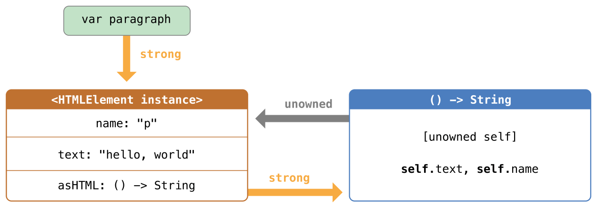

# Swift中文教程（十六） 自动引用计数

Swift使用自动引用计数（ARC）来管理应用程序的内存使用。这表示内存管理已经是Swift的一部分，在大多数情况下，你并不需要考虑内存的管理。当实例并不再被需要时，ARC会自动释放这些实例所使用的内存。

但是，少数情况下，你必须提供部分代码的额外信息给ARC，这样它才能够帮你管理这部分内存。本章阐述了这些情况并且展示如何使用ARC来管理应用程序的内存。

> 注意
引用计数仅仅作用于类实例上。结构和枚举是值类型，而非引用类型，所以不能被引用存储和传递。

## ARC怎样工作

每当你创建一个类的实例，ARC分配一个内存块来存储这个实例的信息，包含了类型信息和实例的属性值信息。

另外当实例不再被使用时，ARC会释放实例所占用的内存，这些内存可以再次被使用。

但是，如果ARC释放了正在被使用的实例，就不能再访问实例属性，或者调用实例的方法了。直接访问这个实例可能造成应用程序的崩溃。

为了保证需要实例时实例是存在的，ARC对每个类实例，都追踪有多少属性、常量、变量指向这些实例。当有活动引用指向它时，ARC是不会释放这个实例的。

为实现这点，当你将类实例赋值给属性、常量或变量时，指向实例的一个强引用（strong reference）将会被构造出来。被称为强引用是因为它稳定地持有这个实例，当这个强引用存在是，实例就不能够被释放。

## ARC实例

下面的例子展示了ARC是怎样工作的。定义一个简单的类Person，包含一个存储常量属性name：

    class Person {
        let name: String
        init(name: String) {
            self.name = name
            println("\(name) is being initialized")
        }
        deinit {
            println("\(name) is being deinitialized")
        }
    }

Person类有一个初始化方法来设置属性name并打印一条信息表明这个初始化过程。还有一个析构方法打印实例被释放的信息。

下面的代码定义了是三个Person？类型的变量，随后的代码中，这些变量用来设置一个Person实例的多重引用。因为这些变量是可选类型（Person？），它们自动被初始化为nil，并且不应用任何Person实例。

    var reference1: Person?
    var reference2: Person?
    var reference3: Person?

现在你可以创建一个Person实例并赋值给其中一个变量：

reference1 = Person(name: "John Appleseed")
// prints "John Appleseed is being initialized"

注意这条信息：““John Appleseed is being initialized”，指出类Person的构造器已经被调用。

因为新的Person实例被赋值给变量reference1，因此这是一个强引用。由于有一个强引用的存在，ARC保证了Person实例在内存中不被释放掉。

如果你将这个Person实例赋值给更多的变量，就建立了相应数量的强引用：

    reference2 = reference1
    reference3 = reference1

现在有三个强引用指向这个Person实例了。

如果你将nil赋值给其中两个变量从而切断了这两个强引用（包含原始引用），还有一个强引用是存在的，因此Person实例不被释放。

    reference1 = nil
    reference2 = nil

直到第三个强引用被破坏之后，ARC才释放这个Person实例，因此之后你就不能在使用这个实例了：

    reference3 ＝ nil

## 类实例间的强引用循环

在上面的例子中，ARC跟踪指向Person实例的引用并保证只在Person实例不再被使用后才释放。

但是，写出一个类的实例没有强引用指向它这样的代码是可能的。试想，如果两个类实例都有一个强引用指向对方，这样的情况就是强引用循环。

通过在类之间定义弱的（weak）或无主的（unowned）引用可以解决强引用循环这个问题。这些方法在“解决类实例间的强引用循环“（“Resolving Strong Reference Cycles Between Class Instances”）描述。但是，在学习怎样解决这个问题前，先来理解这样的循环是怎样造成的。

下面的例子描述了强引用循环是怎样无意中被造成的。定义了两个类Person和Apartment，建立了公寓和它的住户间的关系

    class Person {
        let name: String
        init(name: String) { self.name = name }
        var apartment: Apartment?
        deinit { println("\(name) is being deinitialized") }
    }
    class Apartment {
        let number: Int
        init(number: Int) { self.number = number }
        var tenant: Person?
        deinit { println("Apartment #\(number) is being deinitialized") }
    }

每个Person实例有一个String类型的属性name和一个初值为nil的可选属性apartment。之所以apartment是可选属性，因为一个住户可能并没有一个公寓。

同样，每个Apartment实例有一个Int类型的属性number和一个初值为nil的可选属性tenant，一个公寓（apartment）并不总是有人居住，所以tenant是可选属性。

两个类都定义了析构方法，打印表明类实例被析构的语句，这告诉你Person和Apartment实例是否如愿的被释放掉了。

下面的代码定义了两个可选类型变量john和number73，将用来设置之后的Apartment和Person实例。两个变量都被初始化为nil：

    var john: Person?
    var number73: Apartment?

下面创建两个Person实例和Apartment实例赋值给上面的变量：

    john = Person(name: "John Appleseed")
    number73 = Apartment(number: 73)

下面的图表明在创建这两个实例并赋值后的样子，变量john有一个指向Person实例的强引用，变量number73有一个指向Apartment实例的强引用：

现在你可以将这两个实例连接起来，使得一个住户与一个公寓一一对应起来，注意感叹号用来解开（？unwrap）并访问john和number73中的可选变量，因此属性可以被设置：

    john!.apartment = number73
    number73!.tenant = john

下图是连接后的强引用管理图示：

不幸的是，这样做造成了两个实例间的强引用循环。因此，当你破坏john和number73变量间的强引用、时，引用计数并没有减少到0，ARC也不会释放实例：

    john = nil
    number73 = nil

当你将两个变量设置为nil时，各自的析构方法都不会被调用到。强引用循环防止了Person和Apartment实例被释放造成的内存泄漏。

下图是设置john和number73为nil后的情况：

Person实例和Apartment之间的强引用并没有被破坏掉。

## 解决类实例之间的强引用循环

Swift提供了两种方法解决类实例属性间的强引用循环：弱引用和无主（unowned）引用。

弱引用和无主引用使得一个引用循环中实例并不需要强引用就可以指向循环中的其他实例。互相引用的实例就不用形成一个强引用循环。

当在生命周期的某些时刻引用可能变为nil时使用弱引用。相反，当引用在初始化期间被设置后不再为nil时使用无主引用。

### 弱引用

弱引用并不保持对所指对象的强烈持有，因此并不阻止ARC对引用实例的回收。这个特性保证了引用不成为强引用循环的一部分。指明引用为弱引用是在生命属性或变量时在其前面加上关键字weak。

使用弱引用不管在生命周期的某时刻是否有值。如果引用一直有值，使用无主引用（见无主引用节）。在上例中，公寓不可能一直都有住户，所以应该使用弱引用，来打破强引用循环。

> 注意
弱引用必须声明为变量，指明它们的值在运行期可以改变。弱引用不能被声明为常量。

因为弱引用可以不含有值，所以必须声明弱引用为可选类型。因为可选类型使得Swift中的不含有值成为可能。

因为弱引用的这个特性，所以当弱引用指向实例时实例仍然可以被释放。实例释放后，ARC将弱引用的值设置为nil。你可以想其他可选类型一样检查弱引用的值，你也不会使用所指向实例不存在的的引用。

与上面的例子不同，下例声明了Apartment的属性tenant为弱引用：

    class Person {
        let name: String
        init(name: String) { self.name = name }
        var apartment: Apartment?
        deinit { println("\(name) is being deinitialized") }
    }
    class Apartment {
        let number: Int
        init(number: Int) { self.number = number }
        weak var tenant: Person?
        deinit { println("Apartment #\(number) is being deinitialized") }
    }

依然像前例一样创建两个变量（john和number73）和它们之间的强引用：

    var john: Person?
    var number73: Apartment?
    john = Person(name: "John Appleseed")
    number73 = Apartment(number: 73)
    john!.apartment = number73
    number73!.tenant = john

下图是两个实例之间是怎样引用的：

Person实例仍然有一个到实例Apartment的强引用，相反实例Apartment实例只有一个到Person实例弱引用。意味着当你破坏john变量持有的强引用时，到Person实例的强引用就不存在了。

因为没有到Person实例的强引用，实例可以释放：

    john ＝ nil

仅存的强引用是从变量number73到Apartment实例的强引用，当你破坏它时，这个强引用就不存在了：

因此可以释放Person：

    number73 ＝ nil

上面两段代码展示了Person实例和Aparment实例的析构，当两个变量分别被设置为nil时，就打印各自的析构提示信息，展示了引用循环被打破了。

### 无主引用

和弱引用一样，无主引用也并不持有实例的强引用。但和弱引用不同的是，无主引用通常都有一个值。因此，无主引用并不定义成可选类型。指明为无主引用是在属性或变量声明的时候在之前加上关键字unowned。

因为无主引用非可选类型，所以每当使用无主引用时不必解开（unwrap？）它。无主引用通常可以直接访问。但是当无主引用所指实例被释放时，ARC并不能将引用值设置为nil，因为非可选类型不能设置为nil。

> 注意
在无主引用指向实例被释放后，如果你像访问这个无主引用，将会触发一个运行期错误（仅当能够确认一个引用一直指向一个实例时才使用无主引用）。在Swift中这种情况也会造成应用程序的崩溃，会有一些不可预知的行为发生，尽管你可能已经采取了一些预防措施

接下来的例子定义了两个类，Customer和CreditCard，表示一个银行客户和信用卡。这两个类的属性各自互相存储对方类实例。这种关系存在着潜在的强引用循环。

这两个类之间的关系稍微和前面的Person和Apartment有些不同。在此例中，一个客户可能有也可能没有一个信用卡，但是一个信用卡必须由一个客户持有。因此，类Customer有一个可选的card熟悉，而类CreditCard有一个非可选customer属性。

另外，创建CreditCard实例时必须必须向其构造器传递一个值number和一个customer实例。这保证了信用卡实例总有一个客户与之联系在一起。

因为信用卡总由一个用户持有，所以定义customer属性为无主引用，来防止强引用循环。

    class Customer {
        let name: String
        var card: CreditCard?
        init(name: String) {
            self.name = name
        }
        deinit { println("\(name) is being deinitialized") }
    }
    class CreditCard {
        let number: Int
        unowned let customer: Customer
        init(number: Int, customer: Customer) {
            self.number = number
            self.customer = customer
        }
        deinit { println("Card #\(number) is being deinitialized") }
    }

下面的代码段定义了Customer类型可选变量john，用来存储一个特定用户的引用，这个变量初值为nil：

    var john: Customer?

现在可以创建一个Customer实例，并初始化一个新的CreditCard实例来设置customer实例的card属性：

    john = Customer(name: "John Appleseed")
    john!.card = CreditCard(number: 1234_5678_9012_3456, customer: john!)

下图是引用间的连接管理：

Customer实例有一个到CreditCard实例的强引用，CreaditCard实例有一个到Customer实例无主引用。

因为无主引用的存在，当你破坏变量john持有的强引用时，就再也没有到Customer实例的强引用了。

因为没有到Customer实例的强引用，实例被释放了。之后，到CreditCard实例的强引用也不存在了，因此这个实例也被释放了：

    john = nil
    // prints "John Appleseed is being deinitialized"
    // prints "Card #1234567890123456 is being deinitialized"

上面的代码段显示了变量john设置为nil后Customer实例和CreditCard实例被析构的信息。

### 无主引用和隐式拆箱可选属性

上面的弱引用和无主引用例子是更多常见场景中的两个，表面打破强引用循环是必要的。

例子Person和Apartment显示了当互相引用的两个属性被设置为nil时可能造成强引用循环。这种情况可以使用弱引用来解决。

例子Customer和CreditCard显示了一个属性可以设置为nil，而另一个不可以为nil时可能造成的强引用循环。这种情况可以使用无主引用解决。

但是，有第三种情况，两个属性都一直有值，并且都不可以被设置为nil。这种情况下，通常联合一个类种的无主属性和一个类种的隐式装箱可选属性（implicitly unwrapped optional property)。

这保证了两个属性都可以被直接访问，并且防止了引用循环。这一节展示了如何进行这样的设置。

下面的例子定义了两个类，Coutry和City，两者的属性都存放另外一个类的实例。在数据模型中，每个国家都有一个首都，而每个城市都属于一个国家。代码如下：

    class Country {
        let name: String
        let capitalCity: City!
        init(name: String, capitalName: String) {
            self.name = name
            self.capitalCity = City(name: capitalName, country: self)
        }
    }
    class City {
        let name: String
        unowned let country: Country
        init(name: String, country: Country) {
            self.name = name
            self.country = country
        }
    }

为表达这样的关系，City的构造器有一个参数为Country实例，并将他存为country属性。

City的构造器也在Country的构造器中被调用。但是直到一个新的Country实例被完整地初始化，Country构造器不能传递self给City的构造器（在两阶段初始化“Two-Phase Initialization”节描述）

为处理这样的情况，声明Country的属性capitalCity属性为隐式拆箱可选属性，通过在类型注解后加检测符号实现（City！）。这表明capitalCity属性像其他可选属性一样有一个默认值nil，但是可以不需要对值拆箱就可以访问（隐式拆箱选项（implicitly unwrapped optionals）描述）

因为capitalCity有一个默认值nil，所以当在Country的构造器中设置了name属性的值后，一个新的Country实例就完全地被初始化了，这表明Country构造器已经可以传递隐式self属性，从而设置capitalCity属性值。

这表明你可以在一个单独的语句中创建Country和CIty实例，不会造成强引用循环，并且可以不用使用检测符号（！）解包可选值来直接访问capitalCity属性：

    var country = Country(name: "Canada", capitalName: "Ottawa")
    println("\(country.name)'s capital city is called \(country.capitalCity.name)")
    // prints "Canada's capital city is called Ottawa"

上面的例子中，隐式解包选项的使用表示分阶段初始化是可行的。当初始化完成时，capitalCity属性可以像一个非可选值那样访问，并且不会造成强引用循环。

## 闭包的强引用循环

前面你知道了当两个类实例持有对方的强引用时强引用循环是怎样被创建的。你也知道了怎样使用弱引用和无主引用来破坏强引用循环。

当将一个闭包赋值给一个类实例的属性，并且闭包体捕获这个实例时，也可能存在一个强引用循环。捕获实例是因为闭包体访问了实例的属性，就像self.someProperty，或者调用了实例的方法，就像self.someMethod（）。不管哪种情况，这都造成闭包捕获self，造成强引用循环。

这个强引用循环的存在是因为闭包和类一样都是引用类型。当你将闭包赋值给属性时，就给这个闭包赋值了一个引用。本质上和前面的问题相同－两个强引用都互相地指向对方。但是，与两个类实例不同，这里是一个类与一个闭包。

Swift为这个问题提供了一个优美的解决方法，就是闭包捕获列表。但是，在学习怎样通过闭包捕获列表破坏强引用循环以前，有必要了解这样的循环是怎样造成的。

下面的例子展示了当使用闭包引用self时强引用循环是怎样造成当。定义了一个名为HTMLElement的类，建模了HTML文档中的一个单独的元素：

    class HTMLElement {
        let name: String
        let text: String?
        @lazy var asHTML: () -> String = {
            if let text = self.text {
                return "<\(self.name)>\(text)"
            } else {
                return "<\(self.name) />"
            }
        }
        init(name: String, text: String? = nil) {
            self.name = name
            self.text = text
        }
        deinit {
            println("\(name) is being deinitialized")
        }
    }

这个HTMLElement类定义了一个表示元素（例如“p“，”br“）名称的属性name，和一个可选属性text，表示要在页面上渲染的html元素的字符串的值

另外，还定义了一个懒惰属性asHTML。这个属性引用一个闭包，这个闭包结合name与text形成一个html代码字符串。这个属性类型是（）－> String，表示一个函数不需要任何参数，返回一个字符串值。

默认地，asHTML属性赋值为返回HTML标签字符串的闭包。这个标签包含了可选的text值。对一个段落而言，闭包返回”
some text
”或者”
”，取决其中的text属性为“some text”还是nil。

asHTML属性的命名和使用都和实例方法类似，但是，因为它是一个闭包属性，如果想渲染特定的html元素，你可以使用另外一个闭包来代替asHTML属性的默认值。

这个HTMLElement类提供单一的构造器，传递一个name和一个text参数。定义了一个析构器，打印HTMLElement实例的析构信息。

下面是如何使用HTMLElement类来创建和打印一个新的实例：

    var paragraph: HTMLElement? = HTMLElement(name: "p", text: "hello, world")
    println(paragraph!.asHTML())
    // prints "hello, world"

不幸的是，上面所写的HTMLElemnt类的实现会在HTMLElement实例和闭包所使用的默认asHTML值之间造成强引用循环，下面是其图示：

实例的asHTML属性持有其闭包的一个强引用，但是因为闭包在其类内引用self（self.name和self.text方式），闭包捕获类本身，意味着它也持有到HTMLElement实例的引用。强引用循环就这样建立了。（关于闭包捕获值的更多信息，参见CapturingValues）

如果设置paragraph变量值为nil，破坏了到HTMLElement实例的强引用，实例和其闭包都不会被析构，因为强引用循环：

    paragraph ＝ nil

注意HTMLElement析构器中的提示信息不会被打印，表示HTMLElement实例并没有被析构。

## 解决闭包的强引用循环

通过定义捕获列表为闭包的一部分可以解决闭包和类实例之间的强引用循环。捕获列表定义了在闭包体内何时捕获一个或多个引用类型的规则。像解决两个类实例之间的强引用循环一样，你声明每个捕获引用为弱引用或者无主引用。究竟选择哪种定义取决于代码中其他部分间的关系

### 定义捕获列表

捕获列表中的每个元素由一对weak／unowned关键字和类实例（self或someInstance）的引用所组成。这些对由方括号括起来并由都好分隔。

将捕获列表放在闭包参数列表和返回类型（如果提供）的前面：

    @lazy var someClosure: (Int, String) -> String = {
        [unowned self] (index: Int, stringToProcess: String) -> String in
        // closure body goes here
    }

如果闭包没有包含参数列表和返回值，它们可以从上下文中推断出来的话，将捕获列表放在闭包的前面，后面跟着关键字in：

    @lazy var someClosure: () -> String = {
        [unowned self] in
        // closure body goes here
    }

### 弱引用和无主引用

当闭包和实例之间总是引用对方并且同时释放时，定义闭包捕获列表为无主引用。

当捕获引用可能为nil，定义捕获列表为弱引用。弱引用通常是可选类型，并且在实例释放后被设置为nil。这使得你可以在闭包体内检查实例是否存在。

在例子HTMLElement中，可以使用无主引用来解决强引用循环问题，下面是其代码：

    class HTMLElement {
        let name: String
        let text: String?
        @lazy var asHTML: () -> String = {
            [unowned self] in
            if let text = self.text {
                return "<\(self.name)>\(text)"
            } else {
                return "<\(self.name) />"
            }
        }
        init(name: String, text: String? = nil) {
            self.name = name
            self.text = text
        }
        deinit {
            println("\(name) is being deinitialized")
        }
    }

这个HTMLELement实现在之前的基础上在asHTML闭包中加上了捕获列表。这里，捕获列表是[unowned self]，表示作为无主引用来捕获自己而不是强引用。

你可以像之间一样创建和打印HTMLElement实例：

    var paragraph: HTMLElement? = HTMLElement(name: "p", text: "hello, world")
    println(paragraph!.asHTML())
    // prints "hello, world"

下图是使用捕获列表后的引用图示：

此时，闭包捕获自身是一个无主引用，并不持有捕获HTMLelement实例的强引用。如果你设置paragraph的强引用为nil，HTMLElement实例就被释放了，可以从析构信息中看出来：

    paragraph = nil
    // prints "p is being deinitialized"

